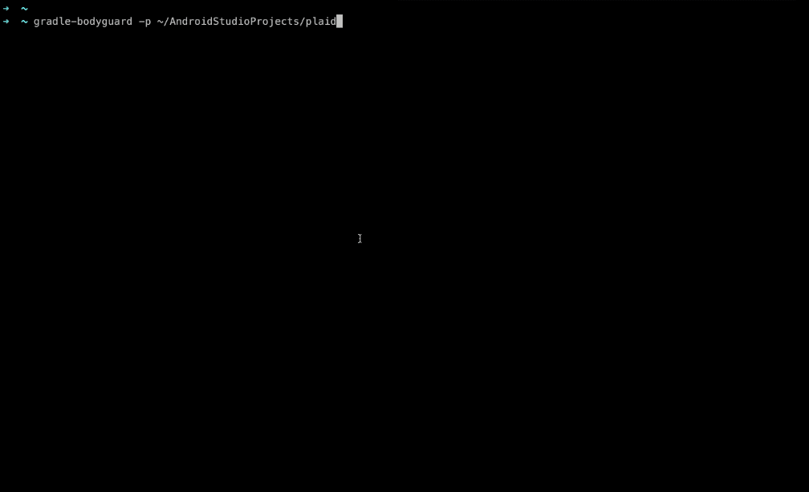

# Gradle Bodyguard



## What is this?

> *Complete blog post to come. Stay tunned!*

[Supply chain attacks](https://arstechnica.com/information-technology/2020/04/725-bitcoin-stealing-apps-snuck-into-ruby-repository/) are a reality and the JVM ecosystem is not safe.

There are several tools out there that help developers from JVM-based languages to protect against supply chain attacks - like [Dependabot](https://dependabot.com/), [Snyk](https://snyk.io/), [DependencyCheck](https://github.com/jeremylong/DependencyCheck) - and others.

However, when talking particularly about Gradle projects things start to become a little more tricky, because (but not only) :

- We are insterested not only in the dependencies that our project declares, but also in the transitive ones (actually, transitive dependencies are the main attack vector here);

- Is quite common that Gradle projects - specially multi-module ones - manage dependencies either with [Project extension](https://docs.gradle.org/current/dsl/org.gradle.api.plugins.ExtraPropertiesExtension.html) API or with [buildSrc](https://docs.gradle.org/current/userguide/organizing_gradle_projects.html#sec:build_sources). In these two cases, tools like Dependabot - which parses your Gradle files in order to figure out dependencies - get confused or eventually don't find the dependencies;

- Gradle plugins for such type of tools eventually are available, but this means another plugin in your Gradle build;

- OWASP DependencyCheck is quite trick to be used in Android projects.


`gradle-bodyguard` was born to tackle these issues. Written in Python and running as a CLI tool, it requires no additional plugins in your project and exercises your Gradle build - regardless your project layout - and learns about the dependencies that **Gradle already knows**, even the transitive ones.

`gradle-bodyguard` then matches these artifacts against [OSS Index](https://ossindex.sonatype.org/) and outputs the results for you. In this way, you can learn (and automate around) when some dependency introduces a new disclosed [CVE](https://en.wikipedia.org/wiki/Common_Vulnerabilities_and_Exposures) in your build, particularly at CI level.

Because OSSIndex is free to use, this tool was possible to be made. 😎

## Setup

Install with [pip](https://www.w3schools.com/python/python_pip.asp). Requires Python 3.8.+ or newer.

```bash
→ pip install gradle-bodyguard
```

## Using

The most basic usage takes only a path to the target Gradle project you want to examine:

```bash
→ gradle-bodyguard -p <path-to-gradle-project>
```

You should see results in your terminal screen 🔥

You also can have a `json` version of the security report. This file is only generated when the tool find potential vulnerabilities :

```bash
→ gradle-bodyguard -p <path-to-gradle-project> -d <path-to-folder>
```

The `gradle-bodyguard-report.json` file will be stored at `folder`

If you realise that some CVEs actually don't impact your project at all, you can just ignore them and exclude such CVEs from the results

```bash
→ gradle-bodyguard -p <path-to-gradle-project> -i <CVE-ID>,<CVE-ID>,<CVE-ID>
```

See usage for a full list of options

```bash
→ gradle-bodyguard --help
```

## Using as a Github Action

Coming soon 🔥

## Limitations

As mentioned previously, `gradle-bodyguard` is backed by the amazing [OSS Index](https://ossindex.sonatype.org/), offered by [Sonatype](https://ossindex.sonatype.org/). If you were not aware of this product until now, you should have a look.

One limitation that `gradle-bodyguard` has is the following : this tool does not require your OSS Index `API TOKEN` for [authenticated REST API calls](https://ossindex.sonatype.org/doc/rest); **bodyguard** avoids that by batching the dependencies computed in the Gradle project and querying 125 Maven coordinates per HTTP request - since this option is [available at all](https://ossindex.sonatype.org/rest#/Component%20vulnerability%20reports/post).

This should work fine for most of small/medium projects out there(up to 500 dependencies including the transitive ones), and therefore the usage of the tool is a bit simpler as well.

If your project consumes way more dependencies than aforementioned and you started to see `429s` in logs when using `gradle-bodyguard`, fill an issue with a feature request, I'll be happy to implement that.


## Credits

I'd like to thank in special :

- [Python Poetry](https://python-poetry.org/) because it allowed a newcomer in the Python ecosystem to build and ship his first package on Pypi with an amazing developer experience
- [Sonatype](https://ossindex.sonatype.org/) for providing OSSIndex (and its companion REST API) for free to the open-source community


## Author

Coded by Ubiratan Soares (follow me on [Twitter](https://twitter.com/ubiratanfsoares))

## License

```
The MIT License (MIT)

Copyright (c) 2020 Dotanuki Labs

Permission is hereby granted, free of charge, to any person obtaining a copy of
this software and associated documentation files (the "Software"), to deal in
the Software without restriction, including without limitation the rights to
use, copy, modify, merge, publish, distribute, sublicense, and/or sell copies of
the Software, and to permit persons to whom the Software is furnished to do so,
subject to the following conditions:

The above copyright notice and this permission notice shall be included in all
copies or substantial portions of the Software.

THE SOFTWARE IS PROVIDED "AS IS", WITHOUT WARRANTY OF ANY KIND, EXPRESS OR
IMPLIED, INCLUDING BUT NOT LIMITED TO THE WARRANTIES OF MERCHANTABILITY, FITNESS
FOR A PARTICULAR PURPOSE AND NONINFRINGEMENT. IN NO EVENT SHALL THE AUTHORS OR
COPYRIGHT HOLDERS BE LIABLE FOR ANY CLAIM, DAMAGES OR OTHER LIABILITY, WHETHER
IN AN ACTION OF CONTRACT, TORT OR OTHERWISE, ARISING FROM, OUT OF OR IN
CONNECTION WITH THE SOFTWARE OR THE USE OR OTHER DEALINGS IN THE SOFTWARE.
```
